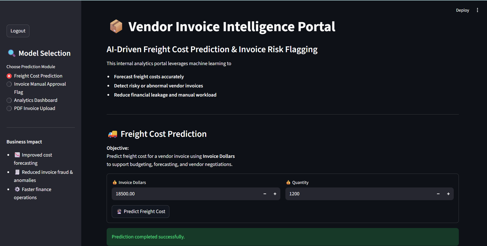
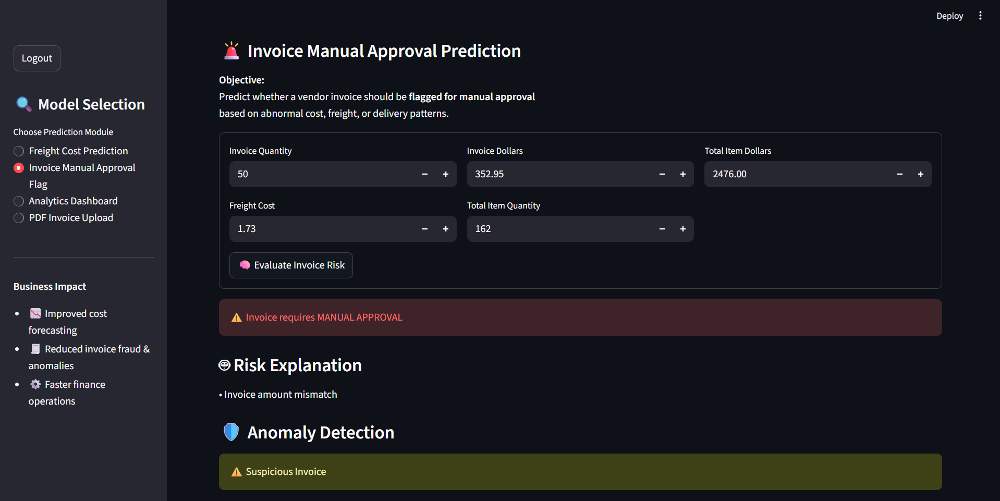

# 🚀 Invoice Sentinel AI
### Intelligent Vendor Invoice Risk & Analytics Platform


---

## 📌 Table of Contents

- [Project Overview](#-project-overview)
- [Business Objectives](#-business-objectives)
- [Data Sources](#️-data-sources)
- [Exploratory Data Analysis](#-exploratory-data-analysis-eda)
- [Models Used](#-models-used)
- [Evaluation Metrics](#-evaluation-metrics)
- [Application](#️-end-to-end-application)
- [Project Structure](#-project-structure)
- [How to Run This Project](#-how-to-run-this-project)
- [Author & Contact](#-author--contact)

---

## 📋 Project Overview

This project implements an **end-to-end machine learning system** designed to support finance teams by:

✅ Freight Cost Prediction (Regression)

✅ Invoice Risk Flagging (Classification)

✅ Invoice Anomaly Detection

✅ AI Risk Explanation Engine

✅ PDF Invoice Upload & Processing

✅ Vendor Performance Scoring

✅ Interactive Analytics Dashboard

✅ Login & Authentication System

✅ Real-Time Business Insights

The system is built on real procurement data stored in a SQLite database, trained using scikit-learn pipelines, and deployed through a Streamlit web application — accessible to non-technical users with no coding required.

---

## 🎯 Business Objectives

### 1. Freight Cost Prediction (Regression)

**Objective:**
Predict the expected freight cost for a vendor invoice using invoice value and historical behavior.

**Why it matters:**
- Freight is a non-trivial component of landed cost.
- Poor freight estimation impacts margin analysis and budgeting.
- Early prediction improves procurement planning and vendor negotiation.

> 📸 *Freight Cost Prediction Module:*
>
> 

---

### 2. Invoice Risk Flagging (Classification)

**Objective:**
Predict whether a vendor invoice should be flagged for manual approval due to abnormal cost, freight, or delivery patterns.

**Why it matters:**
- Manual invoice review does not scale.
- Financial leakage often occurs in large or complex invoices.
- Early risk detection improves audit efficiency and operational control.

> 📸 *Invoice Risk Flagging Module:*
>
> 

---
---

## 🚀 Advanced AI Features

### 1. Invoice Anomaly Detection

The system automatically identifies unusual invoice patterns using machine learning-based anomaly detection.

Output:

- ✅ Normal Invoice
- ⚠️ Suspicious Invoice
- 🚨 Highly Anomalous Invoice

Benefits:

- Fraud detection
- Early risk identification
- Reduced financial leakage

---

### 2. AI Risk Explanation

Instead of only predicting whether an invoice should be approved, the system explains WHY an invoice is risky.

Example Explanations:

- Freight cost unusually high
- Invoice amount mismatch
- Quantity inconsistency
- Abnormal vendor behavior

Benefits:

- Increased transparency
- Better decision-making
- Improved auditability

---

### 3. PDF Invoice Upload & Processing

Users can upload invoice PDFs directly.

Workflow:

Upload PDF
↓
Extract Text
↓
Extract Invoice Values
↓
Run AI Models
↓
Generate Decision

Libraries Used:

- pdfplumber
- PyPDF2

Benefits:

- Eliminates manual data entry
- Faster invoice processing

---

## 🏆 Vendor Performance Score

The platform evaluates vendors and assigns a performance score.

Scoring Factors:

- Freight Efficiency
- Invoice Consistency
- Approval History
- Spending Patterns

Example:

Vendor A → 95/100

Vendor B → 82/100

Vendor C → 65/100

Benefits:

- Vendor ranking
- Procurement optimization
- Better supplier management

## 🗂️ Data Sources

Data is stored in a relational SQLite database (`inventory.db`) with the following tables:

- `vendor_invoice` — Invoice-level financial and timing data
- `purchases` — Item-level purchase details
- `purchase_prices` — Reference purchase prices
- `begin_inventory`, `end_inventory` — Inventory snapshots

SQL aggregation is used to generate **invoice-level features**.
---

## 📊 Exploratory Data Analysis (EDA)

EDA focuses on **business-driven questions**, such as:

- Do flagged invoices have higher financial exposure?
- Does freight scale linearly with quantity?
- Does freight cost depend on quantity?

Statistical tests (t-tests) are used to confirm that flagged invoices differ meaningfully from normal invoices.

Notebooks available in `notebooks/`:
- `Predicting Freight Cost.ipynb`
- `Invoice Flagging.ipynb`

---

## 🤖 Models Used

### Freight Cost Prediction

| Model | Type | Notes |
|---|---|---|
| Linear Regression | Parametric | Baseline — fast and interpretable |
| Decision Tree Regressor | Non-parametric | Captures non-linearities, `max_depth=5` |
| Random Forest Regressor | Ensemble | Best generalization, `max_depth=6` |

> ✅ Best model selected automatically by **lowest MAE** on the held-out test set.

---

### Invoice Risk Flagging

| Model | Type | Notes |
|---|---|---|
| Random Forest Classifier | Ensemble | Tuned with GridSearchCV, `class_weight='balanced'` |

**Hyperparameter Search Space:**

| Parameter | Values Tested |
|---|---|
| `n_estimators` | 100, 200, 300 |
| `max_depth` | None, 4, 5, 6 |
| `min_samples_split` | 2, 3, 5 |
| `min_samples_leaf` | 1, 2, 5 |
| `criterion` | gini, entropy |

> ✅ Best model selected by **F1-Score** across 5-fold cross-validation (1,080 total fits).

**Risk Label Logic — an invoice is flagged if either condition is true:**
- 💰 **Dollar Discrepancy:** `|invoice_dollars - total_item_dollars| > $5`
- ⏰ **Delivery Delay:** Average receiving delay across PO lines `> 10 days`

---

## 📈 Evaluation Metrics

### Freight Prediction
- MAE (Mean Absolute Error)
- RMSE (Root Mean Squared Error)
- R² Score

### Invoice Flagging
- Accuracy
- Precision, Recall, F1-score
- Classification report
- Feature importance analysis

---

## 🖥️ End-to-End Application

A **Streamlit application** demonstrates the complete pipeline:

- Input invoice details
- Predict expected freight
- Flag invoices in real time
- Provide human-readable explanations

| Module | Input | Output |
|---|---|---|
| Freight Cost Prediction | Invoice dollar value | Predicted freight cost ($) |
| Invoice Risk Flagging | Invoice qty, dollars, freight, total PO qty, total PO dollars | ✅ Safe for Auto-Approval / 🚨 Manual Approval Required |

---

## 📁 Project Structure

```
Invoice Sentinel AI/
│
├── app.py
│
├── data/
│   └── inventory.db
│
├── images/
│   ├── freight_prediction.png
│   ├── invoice_flagging.png
│   └── dashboard.png
│
├── notebooks/
│   ├── Predicting Freight Cost.ipynb
│   └── Invoice Flagging.ipynb
│
├── freight_cost_prediction/
│   ├── data_preprocessing.py
│   ├── modeling_evaluation.py
│   └── train.py
│
├── invoice_flagging/
│   ├── data_preprocessing.py
│   ├── modeling_evaluation.py
│   └── train.py
│
├── inference/
│   ├── predict_freight.py
│   └── predict_invoice_flag.py
│
├── models/
│   ├── predict_freight_model.pkl
│   ├── predict_flag_invoice.pkl
│   └── scaler.pkl
│
├── authentication/
│   └── users.db
│
├── uploads/
│   └── uploaded_invoice.pdf
│
├── README.md
│
└── requirements.txt
```

---

## 🚀 How to Run This Project
**Launch the App**

```bash
python -m streamlit run app.py
```

Open your browser at **http://localhost:8501/**
When launching the application for the first time, users must create an account through the Signup page. After registration, log in using your username and password to access the project's features and functionalities.


<p align="center">Built with 🤖 Machine Learning + 🐍 Python + ❤️ for Finance Operations + AYUSHI DHIMAN</p>